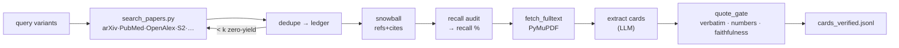

# paper-evidence

Extract verifiable evidence from scientific literature, and **ground LLM claims in it**.

When you ask an LLM to summarize / compare / reason over long papers — or to *generate
hypotheses* from a body of literature — it will produce confident sentences that the
sources never support: invented numbers, misattributed findings, paraphrase drift. This
library refuses to let those through. Its rule: **a claim about a source survives only if
the source verifiably supports it.**

Two layers, usable independently:

| Layer | What | Deps |
|---|---|---|
| **`quote_gate`** — long-text reasoning core | Verify that every claim about a source is backed by a **verbatim** quote, that **numbers sit next to their quote**, and — with an independent **cross-family** LLM judge — that paraphrased/cited claims are actually supported. | **none** (stdlib) |
| **`evidence` + `recall`** — literature extractor | Search literature to **saturation**, **snowball** citations, land full texts, extract verbatim evidence cards, and measure **recall** against a survey's references. | drives the `paper-deep-search` skill |

## Install

```bash
pip install -e ".[llm,pdf]"     # core is dep-free; extras add LLM providers + PDF text
```

Set a provider in `.env` (see `.env.example`):

```bash
PAPER_EVIDENCE_PROVIDER=gemini      # gemini | deepseek | anthropic
GEMINI_API_KEY=...
DEEPSEEK_API_KEY=...                 # a 2nd family enables the cross-family judge
```

## Quickstart — the verification core (no network, no key)

```python
from paper_evidence import quote_gate

source = "The mushroom body is required for olfactory memory; γ neurons show 0.82 correlation."

quote_gate.verify_quote("mushroom body is required for olfactory memory", source)
# -> {'status': 'EXACT', 'ok': True, ...}
quote_gate.verify_quote("mushroom body is required for visual memory", source)   # tampered
# -> {'status': 'FAIL', 'ok': False, ...}
quote_gate.verify_quote("γ neurons show 0.82 correlation", source, numbers=["0.82"])
# -> {'status': 'EXACT', 'ok': True}   # the number must sit next to its quote
```

## Use case — grounding an LLM hypothesis generator

The pattern this was extracted for (e.g. a *Drosophila* neural-function hypothesis
generator): let an LLM propose hypotheses from a corpus, then keep **only** the ones the
literature actually backs, and **block** the rest before they reach your write-up.

```python
from paper_evidence import quote_gate

# 1) You have a verified evidence corpus under ./data/evidence/ (build it with the
#    pipeline below, or hand-write cards.jsonl + papers/Pxx.txt yourself).
# 2) An LLM generated a hypothesis paragraph that cites sources by [P01], [P02]:
hypothesis = (
    'Dopaminergic input to the mushroom body gates memory consolidation [P01]. '
    'We propose the same circuit also controls visual place memory [P02].'      # unsupported
)

# 3) A cross-family judge (different model than the generator) checks each cited claim
gate = quote_gate.build(".", draft_text=hypothesis, judge=quote_gate.make_judge())

for b in gate["blockers"]:
    print("REJECTED:", b["sentence"], "→", b["note"])   # the second claim, if unsupported
supported = gate["passed"]                              # True only if every cited claim holds
```

`quote_gate.build` reads `./data/evidence/cards.jsonl` (verified quotes per source) and
`./data/evidence/papers/*.txt` (the source texts). A cited sentence whose source's cards
don't support it is a **BLOCKER**; a card that fails verbatim/faithfulness is dropped from
`cards_verified.jsonl` with a warning.

## Full pipeline — build the evidence corpus

The search/fetch/snowball layer shells out to the **`paper-deep-search` skill** (install it
under `~/.claude/skills/paper-deep-search/`, or pass `--skill-dir`). It is *not* bundled
here.

```bash
# Measure coverage: search to saturation, snowball citations, audit recall
python scripts/recall_audit.py --query "Drosophila mushroom body memory" \
    --query "fly olfactory learning circuit" --sat-k 3          # --expand for LLM query variants

# Land full texts + extract verbatim evidence cards (LLM), verified against source
python scripts/build_evidence.py --query "Drosophila mushroom body memory" --max-papers 6
```



## One command: search → corpus → grounded hypotheses

`scripts/hypothesis_loop.py` chains the whole thing — grow the ledger to saturation +
snowball, land + extract verbatim cards, generate hypotheses, and keep only those whose
premise the corpus supports:

```bash
python scripts/hypothesis_loop.py \
    --query "Drosophila mushroom body olfactory memory" \
    --query "Drosophila dopamine reward learning" \
    --question "How is olfactory memory encoded in the fly mushroom body?" \
    --max-papers 12 --n 5 --out fly_hypotheses.md
```

Writes `fly_hypotheses.md` + `.jsonl` of grounded hypotheses (premise cited + verified,
prediction novel). Robustness built in from a real fly run: card extraction **self-repairs**
non-verbatim quotes (one re-prompt to copy the exact sentence, else the card is dropped);
verification **tolerates line/marginal numbers** that preprint PDFs inject mid-sentence; and
triage prefers **reliably-OA sources** (arXiv > PMC > publisher pdf) so the land list isn't
filled with paywalled top-cited papers. Live: 6 papers landed → 34 verified cards → 5/5
hypotheses grounded.

## Deep-read one paper (PDF / URL / arXiv)

Self-contained — no search, no skill. Get the text, extract verbatim cards, verify, and
summarize from the verified cards only:

```bash
python scripts/deep_read_paper.py --arxiv 2605.10817 \
    --question "how was it evaluated and what AUROC did it reach?"
python scripts/deep_read_paper.py --pdf paper.pdf --terms dopamine --terms "mushroom body"
```

Writes `deep_read.md` (grounded summary + verified cards). Needs an LLM key; `--pdf` needs
the `pdf` extra (PyMuPDF).

## Semantic anchoring (reworded questions still hit)

Snippet selection is literal by default. Pass `--semantic --question "…"` (or a `--question`
to `deep_read_paper.py`) to instead rank passages by **embedding similarity** to the
question, so a question that shares no words with the text still finds the right passage
(e.g. *"negative valence during learning"* → the sentence about *"dopaminergic punishment
signals"*). Uses Gemini embeddings (`gemini-embedding-001`); falls back to keyword windows
without a key. `semantic.chunk_text/rank_chunks/keyword_windows` are reusable and dep-free.

## What the checks guarantee

- **Quotes are verbatim** — every card's quote is re-greped against its source; a
  paraphrase that drifted is dropped (EXACT / whitespace-and-hyphenation-NORMALIZED only).
- **Numbers are bound to context** — a statistic must appear in a window *next to* its
  quote, not merely somewhere in the paper.
- **Claims are supported, not just quoted** — an independent, **cross-family** judge
  (`make_judge` picks a different model family than the extractor) confirms each claim
  follows from its quote, and that every `[Pxx]` / `\cite{}` sentence in your prose is
  backed by that source's cards. Runs only when a second provider has a key; otherwise the
  gate falls back to verbatim-only (never silently faked).
- **Recall is measured** — search stops only after *k* zero-yield batches; snowball chases
  citations; a survey's references are diffed against the ledger for a concrete number.
- **Citations are real** (`citation.py`) — a DOI / PMID / arXiv id is resolved against
  Crossref / OpenAlex / PubMed / the arXiv API; an id that doesn't resolve is `unverified`
  (likely invented), a flagged one is `RETRACTED` (don't build on it), and an expected title
  is checked against the resolved one.
- **No mis-attribution** (`quote_gate.focus_named`) — a card may carry a `subject`; a verbatim
  quote that doesn't even name that subject is `MISATTRIBUTED` (the quote is real but about
  something else), caught deterministically without an LLM.
- **Evidence is graded** (`evidence_state.py`) — Supported / Tension / Conflict / Unknown +
  a confidence tier, with three rules: overclaim counts only *positive* mis-attribution
  (never silence), a source not mentioning something is Unknown (never Conflict), and
  abstract-only evidence caps confidence at Med.

## Why not just prompt an LLM?

| | One-shot LLM | paper-evidence |
|---|---|---|
| Quotes | may be invented | re-greped verbatim; drift dropped |
| Numbers | may be hallucinated | must sit next to the quote they back |
| Claims about a source | plausible-sounding | cross-family judge must confirm support |
| Coverage | unmeasured | saturation rule + recall audit → a number |
| Failure mode | confident and wrong | honest gap + a BLOCKER before it reaches your output |

## License

MIT — see [LICENSE](LICENSE).

*The search/fetch/snowball layer depends on the separately-installed `paper-deep-search`
skill and is not redistributed here.*
